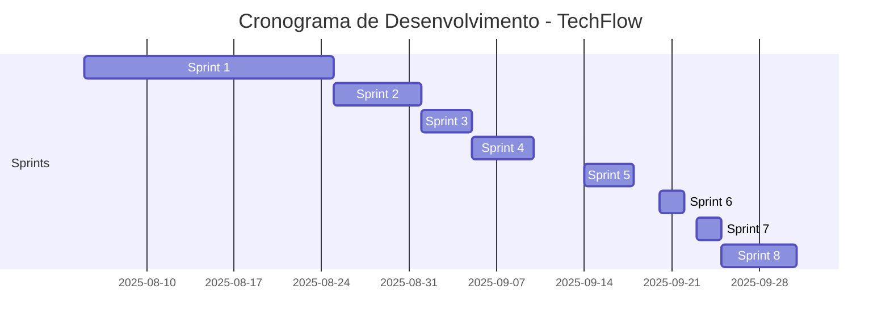

# TechFlow: Plataforma Inteligente de Gestão de Chamados

<div align="center">


<h3>Otimizando Suporte Técnico através de Inteligência Artificial</h3>

**TechFlow | UNIP São José dos Campos**

</div>

---

# 🎯 Descrição do Desafio <a id="desafio"></a> </summary>

O parceiro enfrenta desafios significativos na gestão de suporte técnico, incluindo:

- **📈 Volume crescente** de chamados sem triagem eficiente
- **⏰ Tempo Médio de Resposta (TMR)** elevado devido à falta de automação
- **🔗 Comunicação inadequada** entre usuários e equipe de suporte
- **📊 Falta de métricas** para análise de desempenho e tomada de decisão
- **🔄 Processos manuais** que consomem tempo da equipe especializada


---

<details>
<summary> 📋 Backlog do Produto <a id="backlog"></a> </summary>

| Prioridade | User Story | Story Points | Sprint | Status |
|------------|------------|--------------|---------|---------|
| **Alta** | Como usuário final, quero me cadastrar no sistema para acessar a plataforma | 5 | 1 | ⬜ |
| **Alta** | Como agente de suporte, quero me cadastrar para acessar funcionalidades de suporte | 5 | 1 | ⬜ |
| **Alta** | Como usuário, quero fazer login para acessar funcionalidades conforme meu perfil | 8 | 1 | ⬜ |
| **Alta** | Como agente, quero atualizar status dos chamados para manter usuários informados | 8 | 2 | ⬜ |
| **Alta** | Como usuário, quero registrar comentários para comunicação clara do andamento | 13 | 2 | ⬜ |
| **Média** | Como agente, quero definir prioridades para atender solicitações urgentes primeiro | 5 | 3 | ⬜ |
| **Média** | Como usuário, quero filtrar chamados por data, status e categoria | 13 | 4 | ⬜ |
| **Média** | Como admin, quero registro de todas as alterações para auditoria | 8 | 5 | ⬜ |
| **Média** | Como admin, quero gerar relatórios de desempenho e métricas | 13 | 6 | ⬜ |
| **Média** | Como usuário, quero interface responsiva para uso em qualquer dispositivo | 13 | 7 | ⬜ |
| **Baixa** | Como admin, quero otimizações de performance para escalabilidade | 13 | 8 | ⬜ |

</details>

---

<details>
<summary> 🗓️ Cronograma do Projeto <a id="cronograma"></a> </summary>



</details>

---

<details>
<summary> 📊 Detalhes das Sprints <a id="sprints"></a> </summary>

| Período da Sprint | Documentação da Sprint | 
|-------------------|------------------------|
| **Sprint 1:** 05/08/2025 - 25/08/2025 | [📄 Documentação Sprint 1](link) |
| **Sprint 2:** 25/08/2025 - 01/09/2025 | [📄 Documentação Sprint 2](link) |
| **Sprint 3:** 01/09/2025 - 05/09/2025 | [📄 Documentação Sprint 3](link) |
| **Sprint 4:** 05/09/2025 - 10/09/2025 | [📄 Documentação Sprint 4](link) |
| **Sprint 5:** 14/09/2025 - 18/09/2025 | [📄 Documentação Sprint 5](link) |
| **Sprint 6:** 20/09/2025 - 22/09/2025 | [📄 Documentação Sprint 6](link) |
| **Sprint 7:** 23/09/2025 - 25/09/2025 | [📄 Documentação Sprint 7](link) |
| **Sprint 8:** 25/09/2025 - 01/10/2025 | [📄 Documentação Sprint 8](link) |

</details>

---

<details>
<summary> 🛠️ Tecnologias Utilizadas <a id="tecnologias"></a> </summary>

### Backend
- **Java** - Linguagem principal
- **Spring Boot** - Framework backend
- **Microsoft SQL** - Banco de dados relacional

### Frontend & Design
- **HTML5/CSS3/JavaScript** - Interface web
- **Figma** - Design e prototipagem
- **Bootstrap** - Framework CSS

### Ferramentas & DevOps
- **Git** - Controle de versão
- **Maven** - Gerenciamento de dependências
- **Scrum** - Metodologia ágil

</details>

---

<details>
<summary> 📁 Estrutura do Projeto <a id="estrutura"></a> </summary>

```
techflow/
├── 📁 docs/
│   ├── 📁 sprints/
│   ├── 📁 requisitos/
│   └── 📁 apresentacoes/
├── 📁 src/
│   ├── 📁 main/
│   │   ├── ☕ java/
│   │   │   ├── 📁 controller/
│   │   │   ├── 📁 service/
│   │   │   ├── 📁 repository/
│   │   │   ├── 📁 model/
│   │   │   └── 📁 config/
│   │   └── 📄 resources/
│   │       ├── application.properties
│   │       └── 📁 static/
│   └── 📁 test/
├── 📁 frontend/
│   ├── 📁 css/
│   ├── 📁 js/
│   └── 📁 images/
├── 📁 database/
│   ├── schema.sql
│   └── data.sql
├── 📜 .gitignore
├── 📜 pom.xml
└── 📄 README.md
```

</details>

---

<details>
  
<summary> 📋 Guia de Utilização do Sistema <a id="como-usar"></a> </summary>

### **Visão Geral**
Este documento descreve o fluxo de utilização do portal de chamados, organizado por funcionalidades principais para otimizar sua experiência com o sistema.

---

### **1. Registro de Chamados**
**Objetivo:** Criar novos chamados de forma eficiente e completa
- Acesse a seção "Novo Chamado" no menu principal
- Descreva o problema ou solicitação de forma clara e objetiva
- Selecione a prioridade adequada conforme a urgência do caso
- Anexe documentos complementares quando necessário

### **2. Visualização e Gerenciamento**
**Objetivo:** Acompanhar e gerenciar o ciclo de vida dos chamados
- Visualize a lista completa de chamados em andamento
- Acesse detalhes específicos de cada solicitação
- Atualize o status conforme a evolução do atendimento
- Realize edições e complementações quando necessário

### **3. Pesquisa e Filtros Avançados**
**Objetivo:** Localizar rapidamente chamados específicos
- Utilize filtros por:
  - **Status** (Aberto, Em Andamento, Resolvido, etc.)
  - **Prioridade** (Baixa, Média, Alta, Urgente)
  - **Responsável** pelo atendimento
  - **Cliente** solicitante
  - **Período** por data de abertura ou vencimento
- Combine múltiplos filtros para refinamento preciso

### **4. Relatórios e Análises**
**Objetivo:** Acompanhar métricas e desempenho do serviço
- Acesse relatórios de desempenho da equipe
- Analise tempos médios de resposta e resolução
- Visualize métricas de satisfação do cliente
- Exporte dados para análise externa quando necessário

---

### **📞 Suporte**
Em caso de dúvidas sobre a utilização do sistema, entre em contato com nossa equipe de suporte técnico.
</details>

---

<details>
<summary> 📂 Documentação <a id="documentacao"></a> </summary>

[📁 Acessar Pasta de Documentação Completa](link_para_pasta_documentacao)

A documentação completa do projeto inclui:
- 📋 Documentação de requisitos
- 🎨 Protótipos e wireframes
- 📊 Diagramas de arquitetura
- 🧪 Casos de teste
- 📝 Relatórios de sprint

</details>

---

<details>
<summary> 👥 Equipe <a id="equipe"></a> </summary>

| Nome | Papel | GitHub | LinkedIn |
|------|-------|---------|----------|
| **Tainara Lais Viana Mota** | Product Owner | [@TainaraViana](https://github.com/TainaraViana) | [LinkedIn](link) |
| **André Takashi Prado Takamura** | Scrum Master | [@Yashatk](https://github.com/Yashatk) | [LinkedIn](link) |
| **Fabrício Santos Cavalcante** | Desenvolvedor | [@Kinnube](https://github.com/Kinnube) | [LinkedIn](link) |
| **Thiago Paulino da Silva** | Desenvolvedor | [@thiagooo9](https://github.com/thiagooo9) | [LinkedIn](link) |

</details>

---

<div align="center">

**TechFlow** - Transformando suporte técnico através da inovação  
*Projeto Acadêmico - UNIP São José dos Campos*

</div>
