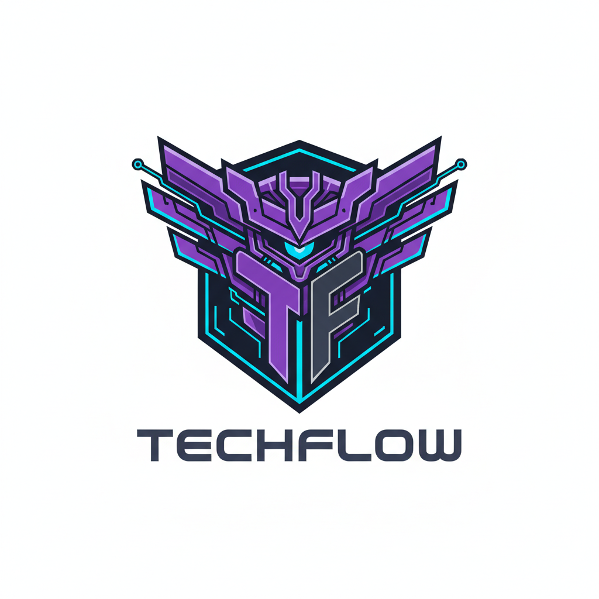

   
  <h3>Tech-Flow</h3>
  
Somos uma equipe de desenvolvedores do ambiente acadêmico da UNIP de São José dos Campos. Nosso grupo é dedicado a aplicar conhecimento técnico de ponta na resolução de problemas práticos do mercado. Unimos uma base teórica sólida com uma abordagem ágil para transformar desafios em software, visando como produto um portal de chamados.

   

<strong>Proposta:</strong> 
Visamos desenvolver um portal de chamados inteligente que visa otimizar o atendimento técnico e a comunicação entre clientes e atendentes. Utilizando Inteligência Artificial, o sistema realiza triagem automática, classificação de solicitações e sugere soluções para problemas frequentes, otimizando o tempo de resposta, melhor organização dos chamados e reduzindo a sobrecarga da equipe de TI.

